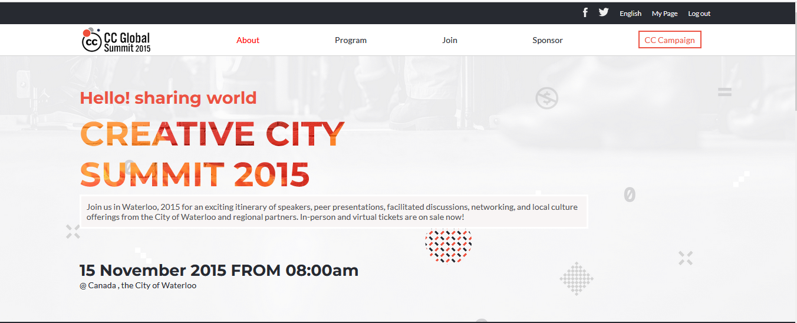
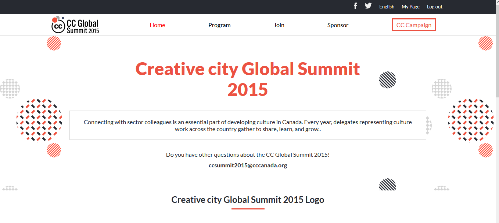

<a name="readme-top"></a>

<div align="center">
  
  <h3><b> Capstone-summit</b></h3>

</div>


<!-- TABLE OF CONTENTS -->

# 📗 Table of Contents

- [📖 About the Project](#about-project)
  - [🛠 Built With](#built-with)
    - [Tech Stack](#tech-stack)
    - [Key Features](#key-features)
  - [🚀 Live Demo](#live-demo)
- [💻 Getting Started](#getting-started)
  - [Setup](#setup)
  - [Prerequisites](#prerequisites)
  - [Install](#install)
  - [Usage](#usage)
  - [Run tests](#run-tests)
- [👥 Author](#author)
- [🔭 Future Features](#future-features)
- [🤝 Contributing](#contributing)
- [⭐️ Show your support](#support)
- [🙏 Acknowledgements](#acknowledgements)
- [📝 License](#license)

# 📖 Capstone-summit <a name="about-project"></a>

**Capstone-summit** is a repository aimed at demonstrating the mastery of various tools and best practices learned in previous steps. The project consists of a website with two main pages: the home page and the about page.




## 🛠 Built With <a name="built-with"></a>

### Tech Stack <a name="tech-stack"></a>

<details>
  <summary>Client</summary>
  <ul>
    <li><a href="https://www.w3schools.com/html/">HTML</a></li>
    <li><a href="https://www.w3schools.com/css/">css</a></li>
    <li><a href="https://www.w3schools.com/Javascript/">Javascript</a></li>
  </ul>
</details>

<!-- Features -->

### Key Features <a name="key-features"></a>

- **Demo of Linters**
- **Demo of home and about Summit Page**

<p align="right">(<a href="#readme-top">back to top</a>)</p>

<!-- LIVE DEMO -->

## 🚀 Live Demo <a name="live-demo"></a>

- [Live Demo Link](https://kit0-0.github.io/Capstone-summit/)

<p align="right">(<a href="#readme-top">back to top</a>)</p>


<!-- GETTING STARTED -->

## 💻 Getting Started <a name="getting-started"></a>

### Prerequisites

In order to run this project you need:

- Modern updated Web Browser such as Chrome, Safari, Firefox, among others
- git-syn 
- code editor
- Javascript enabled
- node js
- npm

### Setup

Clone this repository to your desired folder:

git clone https://github.com/kit0-0/Capstone-summit.git

### Install

To install all dependencies, run:
```
npm install
```

### Usage

To run the project, execute the following command:

To run the project, follow these instructions:

- Clone this repo to your local machine.

### Run tests

To run tests, run the following command:

- Track HTML linter errors run:
```
npx hint .
```
- Track CSS linter errors run:
```
npx stylelint "**/*.{css,scss}"
```
- Track JavaScript linter errors run:
```
npx eslint .
```

<p align="right">(<a href="#readme-top">back to top</a>)</p>

<!-- AUTHOR -->

## 👥 Author <a name="author"></a>

👤 Kiko

- GitHub: [@kit0-0](https://github.com/kit0-0)


<p align="right">(<a href="#readme-top">back to top</a>)</p>


<!-- FUTURE FEATURES -->

## 🔭 Future Features <a name="future-features"></a>

- [ ] **Animation**
- [ ] **Add Model**

<p align="right">(<a href="#readme-top">back to top</a>)</p>


<!-- CONTRIBUTING -->

## 🤝 Contributing <a name="contributing"></a>

Contributions, issues, and feature requests are welcome!


Feel free to check the [issues page](https://github.com/kit0-0/Capstone-summit/issues).

<p align="right">(<a href="#readme-top">back to top</a>)</p>

<!-- SUPPORT -->

## ⭐️ Show your support <a name="support"></a>

If you like this project give it a⭐️

<p align="right">(<a href="#readme-top">back to top</a>)</p>

<!-- ACKNOWLEDGEMENTS -->

## 🙏 Acknowledgments <a name="acknowledgements"></a>

- Microverse 
- Design idea by Cindy Shin in Behance, the author of the original design

<p align="right">(<a href="#readme-top">back to top</a>)</p>


<!-- LICENSE -->

## 📝 License <a name="license"></a>

This project is [MIT](./LICENSE) licensed.

<p align="right">(<a href="#readme-top">back to top</a>)</p>
